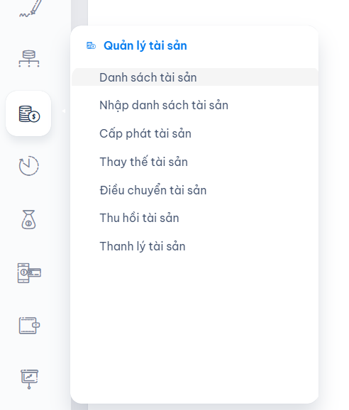
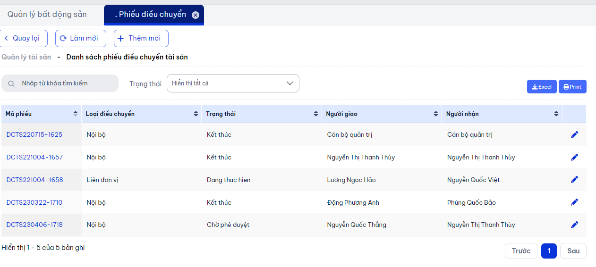

# Điều chuyển tài sản

> Sử dụng tài sản một cách **hiệu quả** hơn để **nâng cao năng suất** hoặc **thay đổi mục đích sử dụng**; điều chỉnh cấu trúc tổ chức và phù hợp với chiến lược kinh doanh; **bảo vệ tài sản** khỏi nguy cơ hoặc mất mát; và tuân thủ quy định pháp lý và quy định về kế thừa...

_Cho phép nhận các đơn điều chuyển tài sản từ chi nhánh, văn phòng khác về đơn vị mình._

## Danh sách phiếu

1. Trên menu chọn `Quản lý tài sản`:



2. Chọn tác vụ **Điều chuyển tài sản**

* Màn hình danh sách phiếu điều chuyển tài sản



```md title="Thông tin chi tiết màn hình danh sách"
# Thông tin chung
- Màn hình danh sách điều chuyển tài sản thể hiện thông tin cơ bản của bản ghi điều chuyển như: 
"Mã phiếu, loại điều chuyển, trạng thái..."

# Chức năng
- Ngoài các chức năng cơ bản như
    + Tìm kiếm nhanh chóng thông tin bản ghi
    + Lọc theo nhiều tiêu chí
    + Chức năng phân trang, thống kê số lượng bản ghi
    + Chức năng sắp xếp tăng/giảm cột

Để xem chi tiết vui lòng click **bản ghi theo highlight của cột mã phiếu**!
```

A new document is now available at [http://localhost:3000/docs/hello](http://localhost:3000/docs/hello).

## Luồng quy trình thực hiện

## Tạo mới bản ghi

Docusaurus automatically **creates a sidebar** from the `docs` folder.

Add metadata to customize the sidebar label and position:

```md title="docs/hello.md" {1-4}
---
sidebar_label: "Hi!"
sidebar_position: 3
---

# Chức năng

This is my **first Docusaurus document**!
```

It is also possible to create your sidebar explicitly in `sidebars.js`:

```js title="sidebars.js"
module.exports = {
  tutorialSidebar: [
    "intro",
    // highlight-next-line
    "hello",
    {
      type: "category",
      label: "Tutorial",
      items: ["QLTS/create-a-document"],
    },
  ],
};
```
