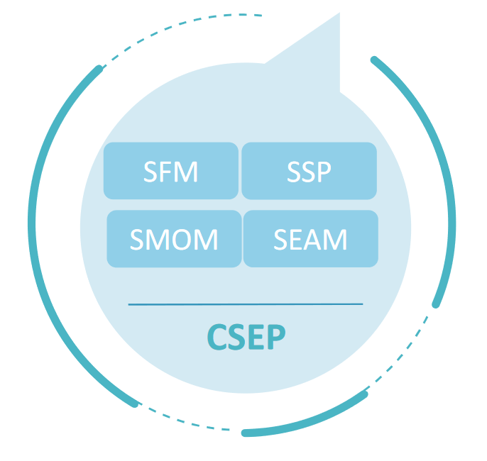
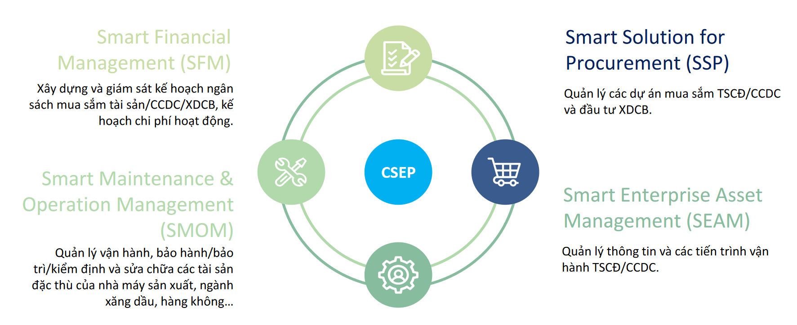

Đôi nét về [HPT Vietnam Corporation](https://hpt.vn/).

## CSEP là gì?

:::note CSEP (COMPREHENSIVE SOLUTION FOR ENTERPRISE POSSESION)

Bộ giải pháp CSEP được xây dựng trên nền tảng (platform) của hãng OpenText. Đã được chứng nhận quyền sở hữu trí tuệ.

:::

- Quản lý **tất cả** các tiến trình **xuyên suốt vòng đời tài sản**.
  Cung cấp thông tin đa chiều về **mọi khía cạnh của tài sản**
- Cung cấp kiến trúc mở tương thích với **mọi mô hình tổ chức** từ đơn giản đến phức tạp.
- Tính ổn định cao, cùng năng lực xử lý mạnh mẽ, phục vụ **số lượng người dùng lớn** và quản lý số lượng đến **hàng triệu tài sản** thuộc mọi chủng loại tài sản.
- Năng lực tùy chỉnh, phát triển linh hoạt. Có thể **xây dựng thêm các chức năng** cho các nhu cầu đặc thù khác của từng tổ chức

[link](https://www.example.com/my%20great%20page)

## Các ứng dụng thành phần

